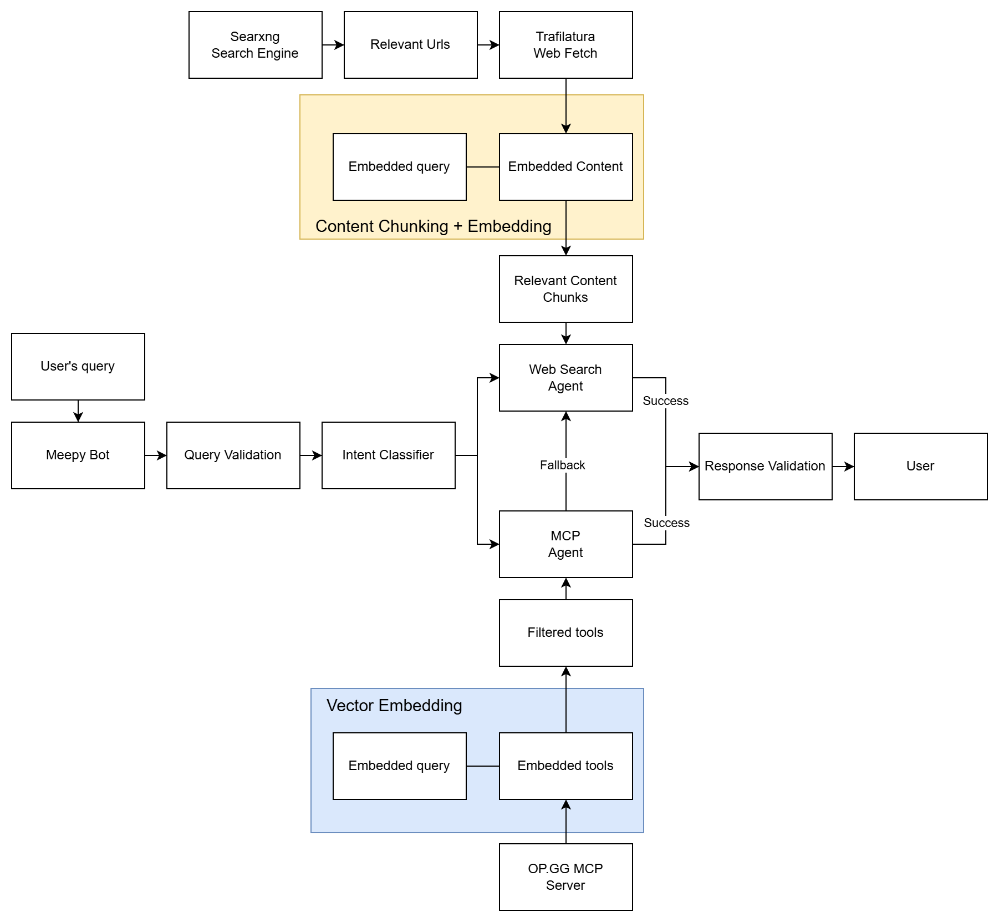

## Introduction
Meepy Bot is a League of Legends AI chatbot that you can add as a friend in the game. It uses the LCU ([League Client Update](https://riot-api-libraries.readthedocs.io/en/latest/lcu.html)) API to receive your messages, process them with AI agents and send replies back in real time.

## How to use
Simply send a friend request to **Meepy#Bot** to get started!
> **Note:** Currently available only in the SEA region.


## Real-world usage
Instead of relying on traditional methods like web browsing or installing third-party tools, users can simply message the chatbot directly in-game to retrieve the information they need in real time.

### Examples
> /msg **Meepy#Bot** What does Zed build in mid lane?

> /msg **Meepy#Bot** What runes do I take for Shaco jg?

> /msg **Meepy#Bot** What does Aphelios do?

> /msg **Meepy#Bot** Who is the current world champion?

> /msg **Meepy#Bot** Who is the current CEO of Riot Games?

## Features
1. **Custom Commands**  
   Use `!help` to view all available commands and how to use them.

2. **Automated Friend Accept**  
   Automatically accepts friend requests and sends a welcome message.

3. **Web and MCP Agents**  
   Supports web search functionality and OP.GG MCP agents for retrieving game statistics and information.

---

## Technical flow


## Installation
If you would like to modify or set up your own bot, follow the steps below.

### 1. Install dependencies

```bash
pip install -r requirements.txt
```

---

### 2. Set your OpenAI API key

Open chatbot.py and set your OpenAI API key.

> The bot currently uses an OpenAI model. You may modify it if needed.


### 3. Set up SearXNG (Search Engine)

You have two options:

**Option A - Run your own SearXNG instance (Docker)**

Follow the official guide:
https://docs.searxng.org/admin/installation-docker.html

**Option B - Use a public instance**

You can use a public SearXNG instance here:
https://searx.space/

Then open src/agents/web_search.py and update the URL accordingly:


### 4. Run the bot
1. Log in to the League of Legends client. (This client will be the chatbot receiving user's messages)
2. Run chatbot.py:
```bash
python chatbot.py
```
3. If everything is done correctly, you should see **"Bot is logged in as: {BotName#Tag}"** in console.

## Credits
- OP.GG mcp - https://op.gg/open-source/opgg-mcp
- LCU wrapper - https://github.com/sousa-andre/lcu-driver
- Needlework - https://github.com/BlossomiShymae/Needlework
